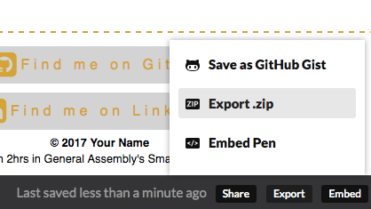
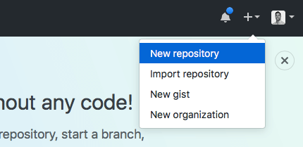
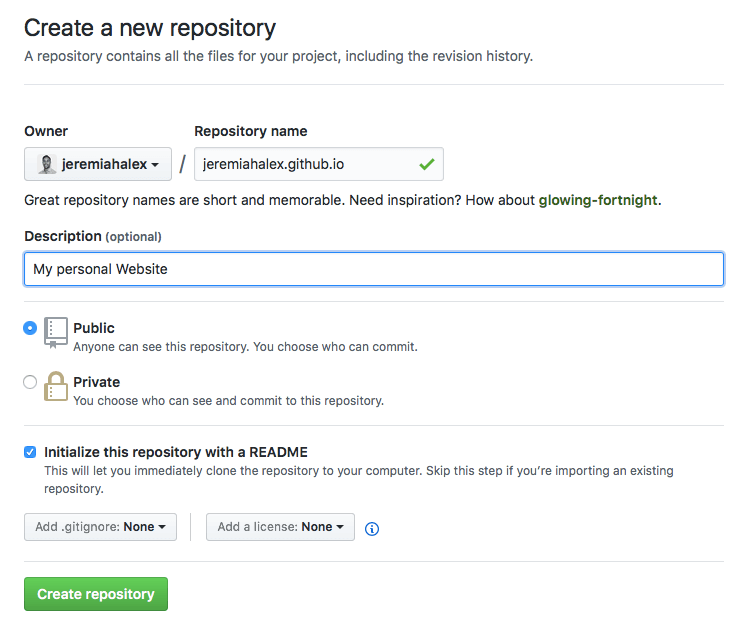
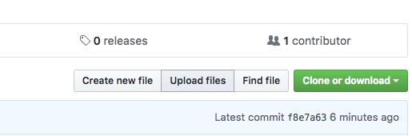
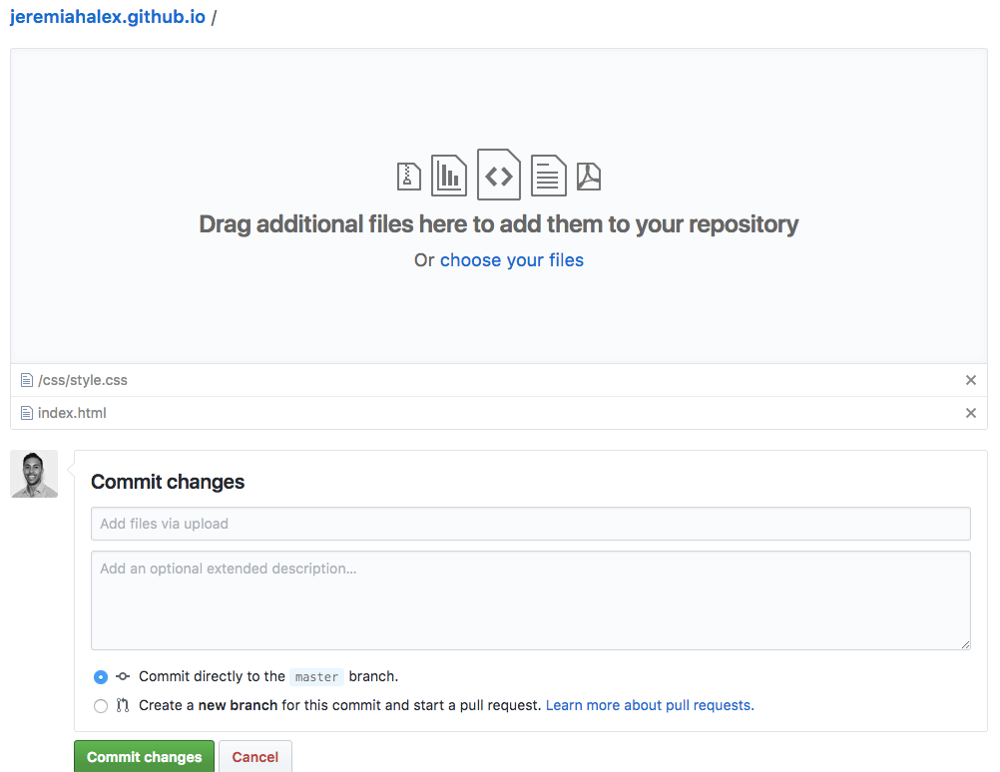

# Smart Coding 101
Coding is good in theory but it's even better in practice, so let's get coding! 

We are going to use an online code editor called Codepen to write our HTML and CSS. We've already made a template project for you, with all the best settings! [Click here to go to the template](http://codepen.io/ga-sg/pen/GWMwOE).

So that you can save your progress, hit the `FORK` button on the header bar. This will create your own copy of the template - you can also change the title if you like.

## Part 1: Describing Content with HTML
Below is some placeholder text for our website - you can update this later with your own details.

```txt
Your Full Name

This is your personal statement. A short intro that summarises you, your major achievements and your life objectives. Give it some character and reflect your personality.

About Me

This is a more detail section where you can write a few paragraphs that describe you in much more detail. Depending on how you want to use this site, this could be about your craft (e.g. music, art, coding), your studies or your passions (e.g. travel, food, games).

Lorem ipsum is random latin text that designers often use to fill space until they get some real text... Here's some: Lorem ipsum dolor sit amet, consectetur adipisicing elit. Perferendis praesentium exercitationem asperiores consequatur vero necessitatibus, nulla assumenda magnam a quam quidem laudantium voluptatibus fugit reprehenderit in, ipsa consequuntur ea provident.

Suscipit voluptates rerum tenetur a, porro optio deserunt maxime nisi incidunt assumenda labore, voluptas. Quis unde eum omnis excepturi minus dolores, ipsam tenetur deleniti enim sint eaque quod hic vitae.

Magni dolorum, minus vitae magnam facere aperiam porro pariatur vel! Repudiandae, adipisci voluptatibus aliquam nemo quis rem voluptatem sunt, ex officiis iure autem similique. Cum, sequi. Voluptate ad perspiciatis, modi!

Education and Experience

Another Section, where you may want to go into more detail about your education, experience, projects etc. Until then, there's always Lorem ipsum.

Accusantium perferendis odio sapiente earum aliquam, porro, deserunt delectus omnis doloribus blanditiis totam inventore amet quaerat libero, voluptas ex vitae quae, similique at aut fugiat illum. Eligendi, ipsa aliquam est.

Voluptate expedita, excepturi, autem numquam, quos explicabo nulla saepe corrupti blanditiis accusamus incidunt ut, illo a! Ea voluptatum quod, officia veniam incidunt minus perferendis expedita dicta cum ducimus ex ut!

Suscipit voluptates rerum tenetur a, porro optio deserunt maxime nisi incidunt assumenda labore, voluptas. Quis unde eum omnis excepturi minus dolores, ipsam tenetur deleniti enim sint eaque quod hic vitae.

Magni dolorum, minus vitae magnam facere aperiam porro pariatur vel! Repudiandae, adipisci voluptatibus aliquam nemo quis rem voluptatem sunt, ex officiis iure autem similique. Cum, sequi. Voluptate ad perspiciatis, modi!


Find me on Github: https://github.com/your-github-username
Find me on LinkedIn: https://github.com/your-linkedin-username

© 2017 Your Name

Made in 2hrs in General Assembly's Smart Coding 101
```

Copy and paste the above into your HTML tab in Codepen. Oh my, all of our formatting has disappeared, to get it back we need to mark-it-up with HTML. 

### Header, Main, Footer 

Our site has three main components: 
1. the header - where we display your name 
2. the main - where we have all of the text 
3. and the footer - where we have the social media links and the copyright notice. 

Let's wrap each section in the coresponding html tag:  __header__ for the header, __main__ for the main, and footer for the footer.

```html
<header>
  Your Full Name
</header>

<main>
  This is your personal statement. A short intro that summarises you, your major achievements and your life objectives. Give it some character and reflect your personality.

  ... (the rest of the content is here)
</main>

<footer>
  Find me on Github: https://github.com/your-github-username
  Find me on LinkedIn: https://linkedin.com/your-linkedin-username

  © 2017 Your Name

  Made in 2hrs in General Assembly's Smart Coding 101
</footer>
```

### Headings

Wrap Your name in a __h1 tag__ as it is our main page title. 

```html
<header>
  <h1>Your Full Name</h1>
</header>
```

Next we wrap the 'About Me' and 'Education and Experience' titles in __h2 tags__. We also put them inside their own __header__ tags.

```html
<header>
  <h2>About Me</h2>
</header>

... (the rest of the content is here)

<header>
  <h2>Education and Experience</h2>
</header>
```

### Sections

Now that we have our headings in place, let's wrap the three sub sections inside the main in __section tags__.

```html
<main>
  <section>
    This is your personal statement. A short intro that summarises you, your major achievements and your life objectives. Give it some character and reflect your personality.
  </section>
  <header>
    <h2>About Me</h2>
  </header>
  <section>
    This is a more detail section where you can write a few paragraphs that describe you in much more detail. Depending on how you want to use this site, this could be about your craft (e.g. music, art, coding), your studies or your passions (e.g. travel, food, games).

    ... (the rest of the content is here)

    Magni dolorum, minus vitae magnam facere aperiam porro pariatur vel! Repudiandae, adipisci voluptatibus aliquam nemo quis rem voluptatem sunt, ex officiis iure autem similique. Cum, sequi. Voluptate ad perspiciatis, modi!
  </section>
  <header>
    <h2>Education and Experience</h2>
  </header>
  <section>
    Another Section, where you may want to go into more detail about your education, experience, projects etc. Until then, there's always Lorem ipsum.

    ... (the rest of the content is here)

    Magni dolorum, minus vitae magnam facere aperiam porro pariatur vel! Repudiandae, adipisci voluptatibus aliquam nemo quis rem voluptatem sunt, ex officiis iure autem similique. Cum, sequi. Voluptate ad perspiciatis, modi!
  </section>
</main>
```

### Paragraphs
Inside of our two longer sections, we have a number of paragraphs of text, so that the browser will format them correctly, let's wrap each one in __p tags__.

For example, the first section has four paragraphs...

```html
<header>
  <h2>About Me</h2>
</header>
<section>
  <p>
    This is a more detail section where you can write a few paragraphs that describe you in much more detail. Depending on how you want to use this site, this could be about your craft (e.g. music, art, coding), your studies or your passions (e.g. travel, food, games).
  </p>
  <p>
    Lorem ipsum is random latin text that ... (the rest of the content is here)
  </p>
  <p>
    Suscipit voluptates rerum tenetur ... (the rest of the content is here)
  </p>
  <p>
    Magni dolorum, minus vitae magnam ... (the rest of the content is here)
  </p>
</section>
```

### Footer

Let's take some steps to improve the footer section.

#### Navigation

We have two links to our social media profiles, since we class this as a form of navigation, we can wrap them in a __nav tag__.

```html
  <nav>
    Find me on Github: https://github.com/your-github-username
    Find me on LinkedIn: https://linkedin.com/your-linkedin-username
  </nav>
```

#### Navigation Link
Let's turn each link into an __a tag__ so that users can click on it to follow it to our profiles. Don't worry if you don't have a Github Profile, we will set one up later and you can come back and edit this link.

> **Top Tip.** If we set the 'target' attribute to '_blank' it will open the link in a new tab/window rather than changing the current page.

```html
<nav>
  <a href="https://github.com/your-github-username" target="_blank">Find me on Github</a>
  <a href="https://linkedin.com/your-linkedin-username" target="_blank">Find me on LinkedIn</a>
</nav>
```

#### Creator Info
Let's make the copyright notice more important using a __strong tag__. Let's also add a new line between the copyright notice and the creator info by using a __br tag__.

```html
<strong>© 2017 Your Name</strong>
<br>
```

This footer information is not as important as the main site content, so let's wrapping it in a __small tag__.

```html
<small>
  <strong>© 2017 Your Name</strong>
  <br>
  Made in 2hrs in General Assembly's Smart Coding 101
</small>
```

### Review

HTML all done! Your page should look something like this [example html page](./part1-complete.png)

Next we'll learn about CSS. If you've finished early, spend some time personalizing the content with your details,name, about, education etc.

#### Part 1 - final code

```html
<header>
  <h1>Your Full Name</h1>
</header>
<main>
  <section>
    This is your personal statement. A short intro that summarises you, your major achievements and your life objectives. Give it some character and reflect your personality.
  </section>
  <header>
    <h2>About Me</h2>
  </header>
  <section>
    <p>
      This is a more detail section where you can write a few paragraphs that describe you in much more detail. Depending on how you want to use this site, this could be about your craft (e.g. music, art, coding), your studies or your passions (e.g. travel, food, games).
    </p>
    <p>
      Lorem ipsum is random latin text that designers often use to fill space until they get some real text... Here's some: Lorem ipsum dolor sit amet, consectetur adipisicing elit. Perferendis praesentium exercitationem asperiores consequatur vero necessitatibus, nulla assumenda magnam a quam quidem laudantium voluptatibus fugit reprehenderit in, ipsa consequuntur ea provident.
    </p>
    <p>
      Suscipit voluptates rerum tenetur a, porro optio deserunt maxime nisi incidunt assumenda labore, voluptas. Quis unde eum omnis excepturi minus dolores, ipsam tenetur deleniti enim sint eaque quod hic vitae.
    </p>
    <p>
      Magni dolorum, minus vitae magnam facere aperiam porro pariatur vel! Repudiandae, adipisci voluptatibus aliquam nemo quis rem voluptatem sunt, ex officiis iure autem similique. Cum, sequi. Voluptate ad perspiciatis, modi!
    </p>
  </section>
    <header>
      <h2>Education and Experience</h2>
    </header>
    <section>
  <section>
    <p>
      Another Section, where you may want to go into more detail about your education, experience, projects etc. Until then, there's always Lorem ipsum.
    </p>
    <p>
      Accusantium perferendis odio sapiente earum aliquam, porro, deserunt delectus omnis doloribus blanditiis totam inventore amet quaerat libero, voluptas ex vitae quae, similique at aut fugiat illum. Eligendi, ipsa aliquam est.
    </p>
    <p>
      Voluptate expedita, excepturi, autem numquam, quos explicabo nulla saepe corrupti blanditiis accusamus incidunt ut, illo a! Ea voluptatum quod, officia veniam incidunt minus perferendis expedita dicta cum ducimus ex ut!
    </p>  
    <p>
      Suscipit voluptates rerum tenetur a, porro optio deserunt maxime nisi incidunt assumenda labore, voluptas. Quis unde eum omnis excepturi minus dolores, ipsam tenetur deleniti enim sint eaque quod hic vitae.
    </p>
    <p>
      Magni dolorum, minus vitae magnam facere aperiam porro pariatur vel! Repudiandae, adipisci voluptatibus aliquam nemo quis rem voluptatem sunt, ex officiis iure autem similique. Cum, sequi. Voluptate ad perspiciatis, modi!
    </p>
  </section>
</main>
<footer>
  <nav>
    <a href="https://github.com/your-github-username" target="_blank">Find me on Github</a>
    <a href="https://linkedin.com/your-linkedin-username" target="_blank">Find me on LinkedIn</a>
  </nav>
  <small>
    <strong>© 2017 Your Name</strong>
    <br>
    Made in 2hrs in General Assembly's Smart Coding 101
  </small>
</footer>
```

---

## Part 2a: Adding Style To Content With Basic CSS
Now that we've learnt about CSS, let's add some style to our site. In your CSS file or CSS tab in Codepen let's add the following rules. 


### h1
Let's make our main heading a bit fancy, by giving it a black `background-color` and white text `color`. We can make the `font-size` bigger than normal and also increase the `line-height` and `letter-spacing` to give it a bit more of a wow factor. Finally, let's center out `text-align`. Also, let's set the `margin` to 0, so that our h1 fits more snugly.

```css
h1 {
  background-color: black;
  color: white;
  font-size: 30px;
  line-height: 50px;
  letter-spacing: 5px;
  text-align: center;
  margin: 0; 
}
```

### h2
For our section headers we're just going to increase the `font-size` and also `text-align` to the center. Finally, let's change all the text to uppercase with a `text-trasform`.

```css
h2 {
  font-size: 45px;
  text-align: center;
  text-transform: uppercase;
}
```

### main
Let's do something fancy for our main section and give it a `linear-gradient` background fading from white to azure, from the top to the bottom of the page.

```css
main {
  background: linear-gradient(to bottom, white, azure);
}
```

### section
For our sections, we want to apply some `padding` so the text doesn't touch the edge of the screen. We can also set a `max-width` so that on large screens it doesn't stretch out too much. If we also set the `margin` to 'auto' then the correct amount of margin to keep it centered will also be applied. Finally, whilst the gradient is cool, it makes our text less readable, so let's set the `background-color` to white.

```css
section {
  padding: 10px;
  max-width: 960px;
  margin: auto;
  background-color: white;
}
``` 

### footer
For our footer, we also want to add some `padding` and let's also add a `border-top` 2 pixels thick, dashed and in the color of a golden rod. Lastly, let's center the text.

```css
footer {
  padding: 10px;
  border-top: 2px dashed goldenrod;
  text-align: center;
}
```

### Review

Your page should look something like this [basic css page](./part2a-complete.png). If it does, then move straight on to part 2b and we'll get more advanced.

---

## Part 2b: Using Classes For Better Precise Styling
To take our design even further, we'll need to go back and add some class attributes to our HTML. We can then select these classes in our CSS and add more specific styling. You'll need to alternate between the HTMl and CSS tabs for the steps below.

### Main Header
Let's add a `main-header` class to the first header on the page, so we know it is the main one. 

We can also do something fancy by wrapping every odd word in our name in a __span tag__ tag with the class `alternate-color`.

```html
<header class="main-header">
  <h1>Your <span class="alternate-color">Full</span> Name</h1>
</header>
```

In our CSS, let's add styles for those two new classes. First we can tell the browser that anything with the `alternate-color` class should have it's text `color` be that of a dark golden rod - super cool!

```css
.alternate-color {
  color: darkgoldenrod;
}
```

Next, let's get our main-header to be a fixed `height` of 230px. We can then give it a `background-image` and adjust the `background-size` so that it is fully contains the image (i.e. shrink it down if needed). As our image is a square it will repeat, so let's set the `background-position` to center, so it stays nicely in the middle. Finally, we'll set the `position` to be relative - this won't have a visual effect but it will set us up for a cool trick later.

```css
.main-header {
  height: 230px;
  background-image: url("https://raw.githubusercontent.com/wdi-sg/smart-coding-101/master/images/avatar.png");
  background-size: contain;
  background-position: center; 
  position: relative;
}
``` 

Time for a cool trick. By setting the header to have a relative position, we can now position our h1 text on top of it. Let's go back to our h1 style and add a few more rules. Let's set the `position` to be absolute (i.e. we're going to provide instructions on where it should go). Now we'll tell it to anchor itself 0 pixels from the `left`, `right` and `bottom` of the first relative positioned parent i.e. our header. Let's also set the `opacity` to 0.8, which will make it slightly transparent.

```css
h1 {
  background-color: black;
  color: white;
  font-size: 30px;
  line-height: 50px;
  letter-spacing: 5px;
  text-align: center;
  margin: 0; 
  
  /* new stuff below  */
  position: absolute;
  bottom: 0;
  left: 0;
  right: 0;
  opacity: 0.8;
}
```

### Intro Section
The first section of our site is an intro, so let's give it a class attribute called `intro`, so that we can select it and style it in CSS.

```html
<section class="intro">
  This is your personal statement. A short intro that summarises you, your major achievements and your life objectives. Give it some character and reflect your personality.
</section>
```

Let's add some CSS to increase the `font-size`, `text-align` to the center and also add a bit of `padding`.

```css
.intro { 
  font-size: 1.4em;
  text-align: center;
  padding: 20px;
}
```

### Section Headers
We can now update our section headers to make them more WOW. Let's add a class called `section-header` to each, so that we can select them. Let's also add __span tags__ with the `alternate-color` class to the odd words in our section headings

```html
<header class="section-header">
  <h2>About <span class="alternate-color">Me</span></h2>
</header>
```

and 

```html
<header class="section-header">
      <h2>Education <span class="alternate-color">and</span> Experience</h2>
</header>
```

Time for some magic! Let's add some CSS to make the header a fixed `height` with a `background-image` just like the main header but this time we'll set its `background-size` to cover the full space and its `background-attachment` to be fixed in place, so the image doesn't move when the page scrolls - this creates a really awesome parallax effect. Finally, we can get our heading text to vertically center by setting the `display` property to flex and the `justify-content` and `align-items` to center all children - these work with the display type set to flex.

```css
.section-header {
  height: 200px;
  border-top: 3px solid grey; 
  background-image: url("https://raw.githubusercontent.com/wdi-sg/smart-coding-101/master/images/bgs/3.png");
  background-size: cover;
  background-attachment: fixed;
  display: flex;
  justify-content: center;
  align-items: center;
}
```

### Nav
Our last design job is to style the navigation. We'll start by giving our __nav tag__ the class of `social-links`, we'll then give each __a tag__ the class of `link-item`.

> **Bonus.** In the template for this project we added a plugin called Font Awesome, this allows us to add icons to our code. So we've added an icon for github and one linkedIn.

```html
<nav class="social-links">
  <a href="https://github.com/jeremiahalex" class="link-item">
    <i class="fa fa-2x fa-github-square"></i> Find me on Github
  </a>
  <a href="https://linkedin.com/in/jeremiahalexander" class="link-item">
    <i class="fa fa-2x fa-linkedin-square"></i>Find me on LinkedIn
  </a>
</nav>
```

Back to the CSS. For our `social-links` class, we're going to use the `display` type flex and the `flex-wrap` property, so that nested items (i.e. our a tags) will flexibly fill the space available to them. Inside the `link-item` styles we specify a target `width` but tell it to `flex-grow` if space is available. We also use the `display: flex; justify-content: center; align-items: center;` trick to make sure the icon and text align vertically.

Other than that, we try to make it look like a button by adding some `margin`, `padding`, `background-color`, `letter-spacing`, and text `color`. We also set the `text-decoration` to none to remove the underline that anchor tags have by default. Finally, we add a `transition` for use in our last and final trick.

```css
.social-links {
  display: flex;
  flex-wrap: wrap;
}
.link-item {
  width: 300px;
  flex-grow: 1;
  display: flex;
  justify-content: center;
  align-items: center;

  margin: 5px;
  padding: 5px;
  background-color: lightgrey;
  letter-spacing: 0.3em;
  color: goldenrod;
  text-decoration: none;
  transition: all 1s;
}
```

For our last trick, let's change the `background-color` of our link-items to that of a Pale Golden Rod, whenever the user hovers over them. Oh and that `transition` we added above, means that any changes to the style that happen when we hover over it, will animate nicely over 1 second.

```css
.link-item:hover {
  background-color: PaleGoldenRod;
}
```

### Review

HTML & CSS done! Your page should look something like this [example web page](./part2b-complete.png)

Next we'll learn how to deploy it online. If you've finished early, spend some time customising the designing. This [HTML Color List](https://www.w3schools.com/colors/colors_names.asp) and [Font Awesome Icons List](http://fontawesome.io/icons/) might be useful. Also, we've included 10 different backgrounds, named `1.png` through to `10.png`, try changing the `3.png` part of the background-url in your section-header e.g. `background-image: url("https://raw.githubusercontent.com/wdi-sg/smart-coding-101/master/images/bgs/7.png");` - you can also use your own images that you have online, you just need to copy the link to them.

#### Part 2 - final code

**html**

```html
<header class="main-header">
  <h1>Your <span class="alternate-color">Full</span> Name</h1>
</header>
<main>
  <section class="intro">
    This is your personal statement. A short intro that summarises you, your major achievements and your life objectives. Give it some character and reflect your personality.
  </section>
  <header class="section-header">
    <h2>About <span class="alternate-color">Me</span></h2>
  </header>
  <section>
    <p>
      This is a more detail section where you can write a few paragraphs that describe you in much more detail. Depending on how you want to use this site, this could be about your craft (e.g. music, art, coding), your studies or your passions (e.g. travel, food, games).
    </p>
    <p>
      Lorem ipsum is random latin text that designers often use to fill space until they get some real text... Here's some: Lorem ipsum dolor sit amet, consectetur adipisicing elit. Perferendis praesentium exercitationem asperiores consequatur vero necessitatibus, nulla assumenda magnam a quam quidem laudantium voluptatibus fugit reprehenderit in, ipsa consequuntur ea provident.
    </p>
    <p>
      Suscipit voluptates rerum tenetur a, porro optio deserunt maxime nisi incidunt assumenda labore, voluptas. Quis unde eum omnis excepturi minus dolores, ipsam tenetur deleniti enim sint eaque quod hic vitae.
    </p>
    <p>
      Magni dolorum, minus vitae magnam facere aperiam porro pariatur vel! Repudiandae, adipisci voluptatibus aliquam nemo quis rem voluptatem sunt, ex officiis iure autem similique. Cum, sequi. Voluptate ad perspiciatis, modi!
    </p>
  </section>
    <header class="section-header">
      <h2>Education <span class="alternate-color">and</span> Experience</h2>
    </header>
    <section>
  <section>
    <p>
      Another Section, where you may want to go into more detail about your education, experience, projects etc. Until then, there's always Lorem ipsum.
    </p>
    <p>
      Accusantium perferendis odio sapiente earum aliquam, porro, deserunt delectus omnis doloribus blanditiis totam inventore amet quaerat libero, voluptas ex vitae quae, similique at aut fugiat illum. Eligendi, ipsa aliquam est.
    </p>
    <p>
      Voluptate expedita, excepturi, autem numquam, quos explicabo nulla saepe corrupti blanditiis accusamus incidunt ut, illo a! Ea voluptatum quod, officia veniam incidunt minus perferendis expedita dicta cum ducimus ex ut!
    </p>  
    <p>
      Suscipit voluptates rerum tenetur a, porro optio deserunt maxime nisi incidunt assumenda labore, voluptas. Quis unde eum omnis excepturi minus dolores, ipsam tenetur deleniti enim sint eaque quod hic vitae.
    </p>
    <p>
      Magni dolorum, minus vitae magnam facere aperiam porro pariatur vel! Repudiandae, adipisci voluptatibus aliquam nemo quis rem voluptatem sunt, ex officiis iure autem similique. Cum, sequi. Voluptate ad perspiciatis, modi!
    </p>
  </section>
</main>
<footer>
  <nav class="social-links">
    <a href="https://github.com/jeremiahalex" class="link-item">
      <i class="fa fa-2x fa-github-square"></i> Find me on Github
    </a>
    <a href="https://linkedin.com/in/jeremiahalexander" class="link-item">
      <i class="fa fa-2x fa-linkedin-square"></i>Find me on LinkedIn
    </a>
  </nav>
  <small>
    <strong>© 2017 Your Name</strong>
    <br>
    Made in 2hrs in General Assembly's Smart Coding 101
  </small>
</footer>
```

**css**

```css
h1 {
  background-color: black;
  color: white;
  font-size: 30px;
  line-height: 50px;
  letter-spacing: 5px;
  text-align: center;
  margin: 0; 
  
  /* new stuff below  */
  position: absolute;
  bottom: 0;
  left: 0;
  right: 0;
  opacity: 0.8;
}

h2 {
  font-size: 45px;
  text-align: center;
  text-transform: uppercase;
}

main {
  background: linear-gradient(to bottom, white, azure);
}

section {
  padding: 10px;
  max-width: 960px;
  margin: auto;
  background-color: white;
}

footer {
  padding: 10px;
  border-top: 2px dashed goldenrod;
  text-align: center;
}

.alternate-color {
  color: darkgoldenrod;
}

.main-header {
  height: 230px;
  background-image: url("https://raw.githubusercontent.com/wdi-sg/smart-coding-101/master/images/avatar.png");
  background-size: contain;
  background-position: center; 
  position: relative;
}

.intro { 
  font-size: 1.4em;
  text-align: center;
  padding: 20px;
}

.section-header {
  height: 200px;
  border-top: 3px solid grey; 
  background-image: url("https://raw.githubusercontent.com/wdi-sg/smart-coding-101/master/images/bgs/3.png");
  background-size: cover;
  background-attachment: fixed;
  display: flex;
  justify-content: center;
  align-items: center;
}

.social-links {
  display: flex;
  flex-wrap: wrap;
}

.link-item {
  width: 300px;
  flex-grow: 1;
  display: flex;
  justify-content: center;
  align-items: center;

  margin: 5px;
  padding: 5px;
  background-color: lightgrey;
  letter-spacing: 0.3em;
  color: goldenrod;
  text-decoration: none;
  transition: all 1s;
}
.link-item:hover {
  background-color: PaleGoldenRod;
}
```

---

## Part 3 - Get It Online

Ok, so we've built our website and now we're going to deploy it online. As this is a 'smart' coding class, we're going to do that in a very clever and easy way. The first step is to setup an account on Github.com.

### Setting Up Your Github Account
Github is free to register, so [Signup now](https://github.com/). 

Once you have your account, be sure to [upload a profile picture](https://github.com/settings/profile) so that everyone can recognise you, it also let's us do a very cool trick.

We can now use that profile picture on our website. Github allows us to reference the image by creating a URL that includes your username followed by .png, like so: `https://github.com/your-github-username.png`

Go back to Codepen and let's add this to the CSS for our header. __Tip. Don't forget to replace 'your-github-username' with your actual github username that you just created__

```css
.main-header {
  height: 230px;
  background-image: url("https://github.com/your-github-username.png");
  background-size: contain;
  background-position: center; 
  position: relative;
}
```

You can also update the __a tag__ in the footer, to actually link to your Github page.

```html
<a href="https://github.com/your-github-username" class="link-item">
  <i class="fa fa-2x fa-github-square"></i> Find me on Github
</a>
```

### Exporting Your Website From Codepen
Now we're ready to upload your website but we need actual html and css files files. Fortunately, we can export them directly from Codepen, just hit the export button in the bottom right corner and chose the Export .zip option.



We now, have the html and css files we need in order to upload. 

### Create A New Github Repository
We're going to deploy our website to Github, and the first thing we need to do is create a new Repository (you can think of repository as another word for project). Hit the new Repository button in the top right corner of the header bar. 



You want to:
* name your repository `your-github-username.github.io`, where your-github-username is actual github username that you just created
* add a simple description
* tick the box to create a README file
* you can leave the rest of the options as default



Once you've have done that you want hit the `upload` button and then drag and drop the `index.html` file and the `css` folder on to the upload window. Once they have uploaded, you can hit the commit button.





### Review

That's it! It usually takes about 10 minutes (if you're lucky it might be instant) but your website should now be online at `https://your-github-username.github.io/` where your-github-username is actual github username ;-)

---

## The End

Well done! View your results with pride, smile and play around with some styling ideas of your own :-) 

We hope you enjoyed the session.

### Example Solution
The finished [HTML & CSS Files can be downloaded here](https://github.com/wdi-sg/smart-coding-101/archive/master.zip) and [an online example can be seen here](https://wdi-sg.github.io/smart-coding-101).

---

## Licensing
1. All content is licensed under a CC-BY-NC-SA 4.0 license.
2. All software code is licensed under GNU GPLv3. For commercial use or alternative licensing, please contact legal@ga.co.